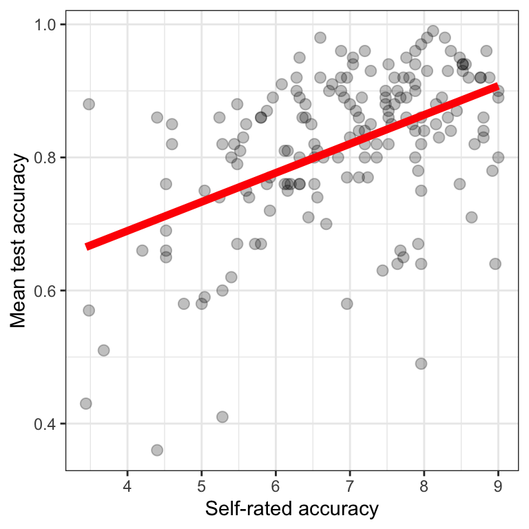
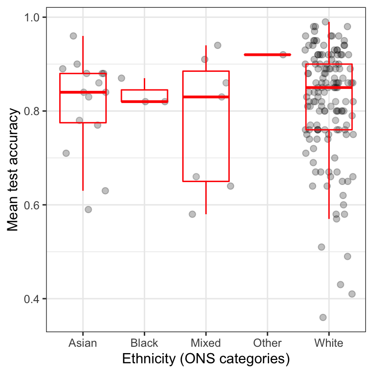

---
output:
  html_document: default
  pdf_document: default
---


```
## ── Attaching packages ─────────────────────────────────────── tidyverse 1.3.1 ──
```

```
## ✓ ggplot2 3.3.5     ✓ purrr   0.3.4
## ✓ tibble  3.1.2     ✓ dplyr   1.0.7
## ✓ tidyr   1.1.3     ✓ stringr 1.4.0
## ✓ readr   1.4.0     ✓ forcats 0.5.1
```

```
## ── Conflicts ────────────────────────────────────────── tidyverse_conflicts() ──
## x dplyr::filter() masks stats::filter()
## x dplyr::lag()    masks stats::lag()
```


```
## 
## ── Column specification ────────────────────────────────────────────────────────
## cols(
##   participant_ID = col_character(),
##   mean.acc = col_double(),
##   mean.self = col_double(),
##   study = col_character(),
##   AGE = col_double(),
##   SHIPLEY = col_double(),
##   HLVA = col_double(),
##   FACTOR3 = col_double(),
##   QRITOTAL = col_double(),
##   GENDER = col_character(),
##   EDUCATION = col_character(),
##   ETHNICITY = col_character()
## )
## 
## 
## ── Column specification ────────────────────────────────────────────────────────
## cols(
##   participant_ID = col_character(),
##   mean.acc = col_double(),
##   mean.self = col_double(),
##   study = col_character(),
##   AGE = col_double(),
##   SHIPLEY = col_double(),
##   HLVA = col_double(),
##   FACTOR3 = col_double(),
##   QRITOTAL = col_double(),
##   GENDER = col_character(),
##   EDUCATION = col_character(),
##   ETHNICITY = col_character()
## )
```


> Rob Davies

# PSYC122 Part 2 Week 17

## Welcome

Welcome to your overview of the materials and guidance you will work with in **PSYC122 Week 17**.

We will complete four classes in weeks 16-19.
These classes are designed to help students to revise and put into practice some of the key ideas and skills you have been developing in the first year research methods modules *PSYC121, PSYC123 and PSYC124*.

We will do this in the context of a live research project with potential real world impacts: the **Clearly understood** project.
Our focus will be on **what makes it easy or difficult for people to understand written health information**.
In these classes, we will complete a research project to answer the research questions:

1. What person attributes predict success in understanding?
2. Can people accurately evaluate whether they correctly understand written health information?

We will be revisiting some of the ideas and techniques you have seen introduced in previous classes.
And we will be extending your development with some new ideas, to strengthen your skills.

Ultimately, we aim to contribute new findings from the data we will collect together.
These new findings will, we hope, help to make the provision of health advice a bit more useful in future.

## Our learning goals

In Week 17, we will ask you to do two things.

1. We will consolidate and *extend* learning on data visualization:

- Use histograms to examine the distributions of variables;
- Use boxplots to examine the differences between groups on a variable;
- Use scatterplots to examine how values on one variable relate to values on another variable;
- Learn to edit the scatterplots;
- Learn to edit the histograms.

2. We will also do some revision on using the correlation test to examine associations between variables. 

We will do this in the context of the health comprehension **Clearly understood** project so that you can see an example of how psychological science proceeds from the statement of research questions to tests of potential answers to those questions in data analysis.

## Resources for you

You will see -- below -- links to the lectures, information about the data we will analyze, and an explanation of the activities.

All the links to the lectures, and everything you need for your practical work class can *also* be found under the **Week 17 resources** section title, on Moodle:

[Link to Moodle](https://modules.lancaster.ac.uk/course/view.php?id=35319#section-9){target="_blank"}

## Lectures: video recordings

The lecture material for this week is presented in three parts.
Click on a link and your browser should open a tab showing the *Panopto* video for the lecture part.
(You will need to be on campus or logged in to the university VPN to get access to the videos.)

[Part 1 of 3](https://dtu-panopto.lancs.ac.uk/Panopto/Pages/Viewer.aspx?id=cb2d5619-e821-4730-8567-ae4600d49805){target="_blank"}

[Part 2 of 3](https://dtu-panopto.lancs.ac.uk/Panopto/Pages/Viewer.aspx?id=c748b016-cca2-45da-b240-ae4600da40ba){target="_blank"}

[Part 3 of 3](https://dtu-panopto.lancs.ac.uk/Panopto/Pages/Viewer.aspx?id=21365e88-7f68-40d4-8c75-ae4600e29a6c){target="_blank"}

### What's in the lectures

The lectures have three main areas of focus.

#### Understanding the scientific process

I suggest that learning about how psychologists ask and answer research questions is key to learning about psychological science.

I outline the way in which, in the **clearly understood** project, we chose our data collection measures -- our theory-based selection of the things we decided to measure -- and I discuss how the data analysis we can do *follows* a series of logical steps: from question, to hypothesis, to analysis. 

I encourage you to begin reflecting on the ways in which, as scientists, you can **critically evaluate this logic, these choices**.

#### Data visualization

Effective data visualization is a core competence in modern work -- in any professional field -- I look at why, what *effective* data visualization is, and how we do it.

We will be learning *practical* coding skills, so that you can produce visualizations, but I put this work in context, relating our approach to the Exploratory Data Analysis approach developed by John Tukey and others.

We want you to actively, reflectively, interrogate or read the plots you make, so that you can use them to get insight into data.

I introduce or remind you about three kinds of plots.

We use histograms like the example shown in Figure \@ref(fig:hist-eg) to examine the distributions of observed values in a variable.

<div class="figure" style="text-align: center">

<p class="caption">(\#fig:hist-eg)A histogram showing the distribution of mean accuracy scores in the study one dataset, the average is shown at the red line</p>
</div>

We use scatterplots, like the example shown in Figure \@ref(fig:scatterplot-eg), to examine a potential association between two variables.

<div class="figure" style="text-align: center">

<p class="caption">(\#fig:scatterplot-eg)A scatterplot showing the potential association between mean (tested) accuracy of understanding and self-rated accuracy of understanding, the linear model best fit line is shown in red</p>
</div>

And we use boxplots, like the example shown in 
Figure \@ref(fig:boxplot-eg), to examine the ways in which values of a numeric variable (e.g., mean accuracy of understanding) may differ, on average, between different groups or different levels of a factor. 

<div class="figure" style="text-align: center">

<p class="caption">(\#fig:boxplot-eg)A boxplot showing the distribution of mean accuracy scores in the study one dataset, in different self-reported ethnicities (groups defined by the Office of National Statistics)</p>
</div>

In  the lecture, I explain how we can learn some lessons about the use of data-based visualizations in scientific communication in the recent COVID-19 pandemic, how the science of visualization emerged, and some of the psychological ideas that lie behind more effective visualization methods.

Everyone needs to learn how to produce and consume data visualizations.

#### Learning to learn (R)

My advice about learning R is to see the challenge as something like the challenge of learning a new language.

I think it is important, maybe *really* important, to see R -- and the community resources provided for and by R users -- as presenting an example of a revolution in how knowledge is produced and shared.

We teach R partly because it is a very powerful language, or set of data analysis tools, partly because it is very popular in science, and (for me, at least) partly because it presents an inspirational, revolutionary, example of *how people can collectively build communities of knowledge*.

Every professional data analyst benefits everyday from the freedom of R -- the wealth of free resources, the openness of the language development.
I would encourage you to begin to learn about how you can find, access and exploit the resources people have contributed.

For example, the central `ggplot()` documentation can be found here:

[The main ggplot resources](https://ggplot2.tidyverse.org){target="_blank"}

A good way to think about the resources available for free online is this:

**In R, every problem you ever have has been resolved, every question you ask has been answered, and someone has written a blog post about it.**

## Readings

We do not provide further reading but you may find it helpful to take another look at the readings provided, previously, for your classes in weeks 11-13.

## Pre-lab activity 1

In weeks 16-19, we will be working together on a research project to investigate how people vary in their response to health advice.
Completing the project involves collecting responses from PSYC122 students.
In our class activities, we can then analyze the data we collect.

To enter your responses, we invite you to complete a short survey.
You can complete the survey here *if you have not already done so*:

[Complete the survey](https://lancasteruni.eu.qualtrics.com/jfe/form/SV_0ww8HHxx172TPJs){target="_blank"}

If you *have* done this once, do not do it again.

### Survey information

The survey asks you to:

- complete some questions about who you are;
- and then answer some questions about what you know about some English words, about what you know about health matters, and about how you approach reading.

The survey then asks you to:

- read five short extracts from patient information leaflets about different kinds of health issue;
- respond to some multiple choice questions about each extract;
- and rate how well you think you understand the advice.

The survey should take about 20 minutes to complete.
Some people will take less time, and some people might take a little more time.

Taking part in the survey is **completely voluntary**.
You can stop at any time without completing the survey if you do not want to finish it.
If you do not want to do the survey, you can do an alternative activity (see below).

All responses will be recorded completely anonymously.

## Pre-lab activity 1 alternative

If you do not want to complete the survey, we invite you to read the pre-registered research plan for the *PSYC122 health advice* research project.

[Read the project pre-registration](https://osf.io/p6fsc/){target="_blank"}

## Pre-lab activity 2: Getting ready for the lab class

### Get your files ready

Download the [122_week17_forStudents.zip](files/week-17/122_week17_forStudents.zip) files you need and upload them to your RStudio Server.

The folder includes data files:

- `study-one-general-participants.csv`
- `study-two-general-participants.csv`

and code files:

- `2021-22-PSYC122-w17-activity.R`
- `2021-22-PSYC122-w17-how-to.R`

You will use `2021-22-PSYC122-w17-activity.R` in the lab activity practical class.

### Review the how-to guide

We show you how to do everything you need to do in the lab activity (see the next section) in the `how-to` guide.

The guide comprises an .R file `2021-22-PSYC122-w17-how-to.R` with code and advice, and a video showing you how the code works.
The code in the .R file was written to work with the data file `study-one-general-participants.csv`.

In the video, I work my way through the R code, step-by-step, explaining what each line of code does.
Watching the video takes about 20 minutes.
It is completely optional but I have provided the video because students have told us they find it useful.

[Watch the how-to guide](https://dtu-panopto.lancs.ac.uk/Panopto/Pages/Viewer.aspx?id=a1f44be4-f53b-46b5-8cd5-ae4600eca3e7){target="_blank"}

## Lab activity

In the lab activity .R file `2021-22-PSYC122-w17-activity.R`, you will work with data from a study about how people respond to guidance about a variety of health topics (general topics):

- `study-two-general-participants.csv`

The data are similar in format to the response data we are collecting as part of the PSYC122 project.

The activity .R file and the data .csv file can be downloaded from:

[122_week17_forStudents.zip](files/week-17/122_week17_forStudents.zip)

Or you can download it from the module Moodle page for PSYC122, the **Week 17 resources** section:

[Link to Moodle](https://modules.lancaster.ac.uk/course/view.php?id=35319#section-9){target="_blank"}

### What is in the activity .R file?

We will take things step-by-step.
We will split .R scripts into parts, tasks and questions:  

The activity tasks are designed to build skills in key data visualization methods, and to start the process of using statistical tests (like correlation) to address the **Clearly understood** research questions.

The focus is on learning how to edit visualization code, step-by-step.
Taking this approach will help to support learning about what elements in the code you can change, and how.

### Tasks

In the activity, we are going to work through the following tasks.

1. Empty the R environment -- using `rm(list=ls())`
2. Load relevant libraries -- using `library()`
3. Read in the data file -- using `read_csv()`
4. Inspect the data -- using `head()` and `summary()`
5. Create basic scatterplots -- using `ggplot()` and `geom_point()`
6. Edit the appearance of plots -- using `alpha`, `size`, `theme_bw()` and `labs()`
6. Edit the appearance of plots -- using `xlim()` and `ylim()`
7. Draw histograms to examine the distributions of variables -- using `ggplot()` and `geom_histogram()`
7. Edit the appearance of *one variable* histogram plot step-by-step
8. Test a correlation using `cor.test()`

The activity `2021-22-PSYC122-w17-activity.R` file takes you through the tasks, one by one.

If you are unsure about what you need to do, check in the `how-to` guide: look at the advice in `2021-22-PSYC122-w17-how-to.R` or watch the accompanying video.

You will see that you can match a task in the `activity` to the same task in the `how-to`.
The `how-to` shows you what function you need and how you should write the function code.
You will need to change the names of the dataset or the variables to complete the tasks in the activity.

This process of adapting demonstration code is a process critical to data literacy and to effective problem solving in working with data in psychological science.

### What is in the data files

Each of the data files we will work with has a similar structure.

```r
head(study.one.general)
```

```
## # A tibble: 6 x 12
##   participant_ID mean.acc mean.self study     AGE SHIPLEY  HLVA FACTOR3 QRITOTAL
##   <chr>             <dbl>     <dbl> <chr>   <dbl>   <dbl> <dbl>   <dbl>    <dbl>
## 1 studyone.1         0.49      7.96 studyo…    34      33     7      53       11
## 2 studyone.10        0.85      7.28 studyo…    25      33     7      60       11
## 3 studyone.100       0.82      7.36 studyo…    43      40     8      46       12
## 4 studyone.101       0.94      7.88 studyo…    46      33    11      51       15
## 5 studyone.102       0.58      6.96 studyo…    18      32     3      51       12
## 6 studyone.103       0.84      7.88 studyo…    19      37    13      45       19
## # … with 3 more variables: GENDER <chr>, EDUCATION <chr>, ETHNICITY <chr>
```

You can see the columns:

- `participant_ID` participant code
- `mean.acc` average accuracy of response to questions testing understanding of health guidance
- `mean.self` average self-rated accuracy of understanding of health guidance
- `study` varianble coding for what study the data were collected in
- `AGE` age in years
- `HLVA` health literacy test score
- `SHIPLEY` vocabulary knowledge test score
- `FACTOR3` reading strategy survey score
- `GENDER` gender code
- `EDUCATION` education level code
- `ETHNICITY` ethnicity (Office National Statistics categories) code

### Answers

You can download the answers version of the activity .R file [2021-22-PSYC122-w17-activity-answers.R](files/week-17/2021-22-PSYC122-w17-activity-answers.R)

The answers version will present my answers for questions, and some extra information where that is helpful.
