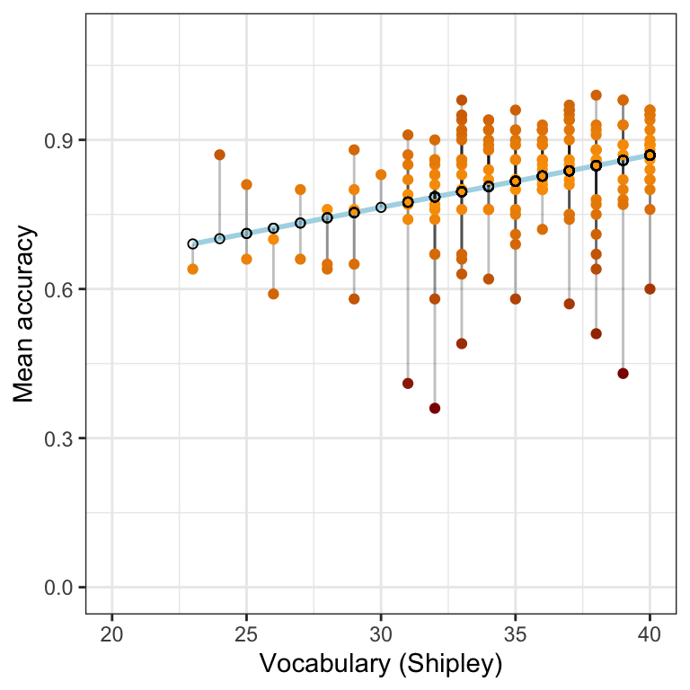

---
output:
  html_document: default
  pdf_document: default
---


```
## Warning: package 'ggExtra' was built under R version 4.1.1
```

```
## Warning: package 'ggridges' was built under R version 4.1.1
```

```
## ── Attaching packages ─────────────────────────────────────── tidyverse 1.3.1 ──
```

```
## ✓ ggplot2 3.3.5     ✓ purrr   0.3.4
## ✓ tibble  3.1.2     ✓ dplyr   1.0.7
## ✓ tidyr   1.1.3     ✓ stringr 1.4.0
## ✓ readr   1.4.0     ✓ forcats 0.5.1
```

```
## ── Conflicts ────────────────────────────────────────── tidyverse_conflicts() ──
## x dplyr::filter() masks stats::filter()
## x dplyr::lag()    masks stats::lag()
```


```
## 
## ── Column specification ────────────────────────────────────────────────────────
## cols(
##   participant_ID = col_character(),
##   mean.acc = col_double(),
##   mean.self = col_double(),
##   study = col_character(),
##   AGE = col_double(),
##   SHIPLEY = col_double(),
##   HLVA = col_double(),
##   FACTOR3 = col_double(),
##   QRITOTAL = col_double(),
##   GENDER = col_character(),
##   EDUCATION = col_character(),
##   ETHNICITY = col_character()
## )
## 
## 
## ── Column specification ────────────────────────────────────────────────────────
## cols(
##   participant_ID = col_character(),
##   mean.acc = col_double(),
##   mean.self = col_double(),
##   study = col_character(),
##   AGE = col_double(),
##   SHIPLEY = col_double(),
##   HLVA = col_double(),
##   FACTOR3 = col_double(),
##   QRITOTAL = col_double(),
##   GENDER = col_character(),
##   EDUCATION = col_character(),
##   ETHNICITY = col_character()
## )
```


> Rob Davies

# PSYC122 Part 2 Week 19

## Welcome

Welcome to your overview of the materials and guidance you will work with in **PSYC122 Week 19**.

We will complete four classes in weeks 16-19.
These classes are designed to help students to revise and put into practice some of the key ideas and skills you have been developing in the first year research methods modules *PSYC121, PSYC123 and PSYC124*.

We will do this in the context of a live research project with potential real world impacts: the **Clearly understood** project.
Our focus will be on **what makes it easy or difficult for people to understand written health information**.
In these classes, we will complete a research project to answer the research questions:

1. What person attributes predict success in understanding?
2. Can people accurately evaluate whether they correctly understand written health information?

We will be revisiting some of the ideas and techniques you have seen introduced in previous classes.
And we will be extending your development with some new ideas, to strengthen your skills.

Ultimately, we aim to contribute new findings from the data we will collect together.
These new findings will, we hope, help to make the provision of health advice a bit more useful in future.

## Our learning goals

In Week 19, we aim to further develop skills in analyzing *and* in visualizing psychological data.

1. Research questions like our questions can often be answered through analyses using linear models.

When we do these analyses, we will need to think about how we report the results:  

- we usually need to report information about the kind of model we specify;
- we will need to report the nature of the association estimated in our model;
- and we usually need to decide, is the association significant?
- does the association reflect a positive or negative relationship between outcome and predictor?
- is the association we see in our sample data relatively strong or weak?

2. As we work, we will develop skills in producing appealing plots for professional audiences. 

At every stage, as we work, we will visualize the data to:

- Understand the shape of the relationships we may observe or predict;
- Evaluate our data so that we can consider the limits or biases in our sample.

## Resources for you

You will see -- below -- links to the lectures, information about the data we will analyze, and an explanation of the activities.

All the links to the lectures, and everything you need for your practical work class can *also* be found under the **Week 18 resources** section title, on Moodle:

[Link to Moodle](https://modules.lancaster.ac.uk/course/view.php?id=35319#section-9){target="_blank"}

## Lectures: video recordings

The lecture material for this week is presented in three parts.
Click on a link and your browser should open a tab showing the *Panopto* video for the lecture part.
(You will need to be on campus or logged in to the university VPN to get access to the videos.)

[Part 1 of 3](https://dtu-panopto.lancs.ac.uk/Panopto/Pages/Viewer.aspx?id=760dac7f-3556-4abd-bbc5-ae4b00f1a0ab){target="_blank"}

[Part 2 of 3](https://dtu-panopto.lancs.ac.uk/Panopto/Pages/Viewer.aspx?id=d6a2b6f8-d58a-49cf-8e7d-ae4b00f7af05){target="_blank"}

[Part 3 of 3](https://dtu-panopto.lancs.ac.uk/Panopto/Pages/Viewer.aspx?id=e9a332e3-3d5d-4dcc-8cfc-ae4b00fcef0b){target="_blank"}

### What's in the lectures

The lectures have two main areas of focus.

#### Understanding the scientific process

I outline the steps through which a psychological scientist may progress, in logic and practice, from research questions to hypotheses to analyses.

I rehearse some of the key points I have discussed, previously, in order to build a framework in which you can understand how we go from a set of concerns -- here, *What makes it easy or difficult to understand written health information?* -- through choices about what data to collect, and how -- to specific questions, and then predictions, that we can test using linear models.

We are learning data analysis methods.
But the key point is that we use these methods in the context of a research project with concerns, aims, methodological assumptions, and choices.
This is generally true so the aim is to present a concrete example of how research works.

As part of the discussion, I raise questions you might want to consider, as you work with your data analysis practices.
These questions -- and questions you can originate for yourselves -- are also part of the context for our data analysis, because they help to inform how you interpret or evaluate the results.
These questions are examples of the *critical evaluation* that you will need to develop through your studies.

#### The linear model

We look at how the linear model can be used to address research questions in the context of the **Clearly understood** health comprehension project.
But I aim to outline some general ideas about why we use the linear model technique, and how it works.
The linear model is central to data analysis practice -- you can say that other methods, like ANOVA, are simply kinds of linear model -- and so the topic merits some investment in time.
I build on work you have done with Margriet Groen in earlier PSYC122 classes, so that we can strengthen understanding, and extend practical skills.

In the lectures, I talk about how we use the linear model to estimate the association between variables -- an outcome like mean accuracy of understanding and a predictor like vocabulary knowledge -- estimating the *expected* change in average outcome, given variation in the predictor.
In the plot on the right of Figure \@ref(fig:ridges), we show the distribution curve of mean (comprehension) accuracy scores observed at each value of vocabulary
You can see that the middle -- the average -- of each distribution, marked by a line, increases as we go from left (low scores) to right (high scores).

<div class="figure" style="text-align: center">

<p class="caption">(\#fig:ridges)Plots showing the association between the outcome mean accuracy of understanding a predictor, vocabulary knowledge, with the plot on the right modified to show how accuracy of understanding varies between individuals in the sample with the sample vocabularytest scores</p>
</div>

I talk about the information we get from a linear model allows us to *predict* the way in which outcome values may vary (increase or decrease), given different values in the predictor variable.
We could form a prediction line anywhere but the linear model helps us to estimate the prediction ("best fit") line that minimizes the differences between observed and predicted outcomes: *the residuals*.

<div class="figure" style="text-align: center">

<p class="caption">(\#fig:lm-show-model-residuals)Plot showing the prediction of mean accuracy of understanding, given information about participant vocabulary knowledge, with lines drawn to show the difference between observed outcomes (shown in orange-red) and predicted outcomes (shown as black circles on the blue line) for each vocabulary test score value in our sample</p>
</div>

The lectures end with a discussion of the critical information you must identify and extract when you view the summary of a linear model results.
I show you how to report the results.
**I give you examples of the conventional language you can use to report your results.**

Notice that, in reporting the results, we need to explain what they tell us about the association between outcome and predictor variables.
And, in reporting results, we can use visualization to help us to interpret the model estimates.
In the how-to guide and in the activity, we look at how you can draw prediction plots, given model estimates.

#### Learning to learn (R)

My advice about learning R is to see the challenge as something like the challenge of learning a new language.
In this context, it is *really* important, to exploit the vast, rich, and free community resources provided for and by R users.
These resources show us an example of the on-going revolution in how knowledge is produced and shared.

In the how-to guide and in the activity, I present further examples of the rich information you can access.

For example, experiment with how to change the appearance of the points in scatterplots:

[ggplot resources for scatterplots](https://ggplot2.tidyverse.org/reference/geom_point.html){target="_blank"}

Or experiment with changing colours:

[resources on colours](http://www.cookbook-r.com/Graphs/Colors_(ggplot2)/){target="_blank"}

In data visualization in R, experimenting with your choices, your code, is how you learn to develop coding skills, and, critically, how you learn what you prefer.

## Readings

We do not provide further reading but you may find it helpful to take another look at the readings provided, previously, for your classes in weeks 11-13.

## Pre-lab activity 1

In weeks 16-19, we will be working together on a research project to investigate how people vary in their response to health advice.
Completing the project involves collecting responses from PSYC122 students.
In our class activities, we can then analyze the data we collect.

To enter your responses, we invite you to complete a short survey.
You can complete the survey here *if you have not already done so*:

[Complete the survey](https://lancasteruni.eu.qualtrics.com/jfe/form/SV_0ww8HHxx172TPJs){target="_blank"}

If you *have* done this once, do not do it again.

**I am going to analyse the data from the survey on Monday 7th March at 12pm so if you are interested in taking part, please do so by then.**

### Survey information

The survey asks you to:

- complete some questions about who you are;
- and then answer some questions about what you know about some English words, about what you know about health matters, and about how you approach reading.

The survey then asks you to:

- read five short extracts from patient information leaflets about different kinds of health issue;
- respond to some multiple choice questions about each extract;
- and rate how well you think you understand the advice.

The survey should take about 20 minutes to complete.
Some people will take less time, and some people might take a little more time.

Taking part in the survey is **completely voluntary**.
You can stop at any time without completing the survey if you do not want to finish it.
If you do not want to do the survey, you can do an alternative activity (see below).

All responses will be recorded completely anonymously.

## Pre-lab activity 1 alternative

If you do not want to complete the survey, we invite you to read the pre-registered research plan for the *PSYC122 health advice* research project.

[Read the project pre-registration](https://osf.io/p6fsc/){target="_blank"}

## Pre-lab activity 2: Getting ready for the lab class

### Get your files ready

Download the [122_week19_forStudents.zip](files/week-19/122_week19_forStudents.zip) files you need and upload them to your RStudio Server.

The folder includes data files:

- `study-one-general-participants.csv`
- `study-two-general-participants.csv`

and code files:

- `2021-22-PSYC122-w19-activity.R`
- `2021-22-PSYC122-w19-how-to.R`

You will use `2021-22-PSYC122-w19-activity.R` in the lab activity practical class.

### Review the how-to guide

We show you how to do everything you need to do in the lab activity (see the next section) in the `how-to` guide.

The guide comprises an .R file `2021-22-PSYC122-w19-how-to.R` with code and advice, and a video showing you how the code works.
The code in the .R file was written to work with the data file `study-one-general-participants.csv`.

In the video, I work my way through the R code, step-by-step, explaining what each line of code does.
Watching the video takes about 25 minutes.
It is completely optional but I have provided the video because students have told us they find it useful.

[Watch the how-to guide](https://dtu-panopto.lancs.ac.uk/Panopto/Pages/Viewer.aspx?id=e7576f79-58c0-4a02-9474-ae4c00ad3cf2){target="_blank"}

## Lab activity

In the lab activity .R file `2021-22-PSYC122-w19-activity.R`, you will work with data from a study about how people respond to guidance about a variety of health topics (general topics):

- `study-two-general-participants.csv`

The data are similar in format to the response data we are collecting as part of the PSYC122 project.

The activity .R file and the data .csv file can be downloaded from:

[122_week19_forStudents.zip](files/week-19/122_week19_forStudents.zip)

Or you can download it from the module Moodle page for PSYC122, the **Week 19 resources** section:

[Link to Moodle](https://modules.lancaster.ac.uk/course/view.php?id=35319#section-9){target="_blank"}

### What is in the activity .R file?

We will take things step-by-step.
We will split .R scripts into parts, tasks and questions:  

The activity tasks are designed to build skills in key data analysis and visualization methods, and to further develop the process of using statistical tests (like the linear model) to address the **Clearly understood** research questions.

### Tasks

In the activity, we are going to work through the following tasks.

1. Empty the R environment -- using `rm(list=ls())`
2. Load relevant libraries -- using `library()`
3. Read in the data file -- using `read_csv()`
4. Inspect the data -- using `head()` and `summary()`
5. Visualize the distribution of values -- using `geom_histogram()`
5. Edit the appearance of plots -- using `xlim()`, `theme_bw()` and `labs()`
6. Visualize the potential association between the values of two variables -- using `geom_point()`
6. Edit the appearance of plots -- using `xlim()` and `ylim()`, and by entering `geom_point()` arguments that you can use to vary the transparency, size, colour, shape of points in a scatterplot
7. Estimate the way in which an outcome may vary, given different values in a predictor variable -- using  `lm()`
8. Visualize the model predictions -- using `geom_abline()` and information from the model results

The activity `2021-22-PSYC122-w18-activity.R` file takes you through the tasks, one by one.

If you are unsure about what you need to do, check in the `how-to` guide: look at the advice in `2021-22-PSYC122-w18-how-to.R` or watch the accompanying video.

You will see that you can match a task in the `activity` to the same task in the `how-to`.
The `how-to` shows you what function you need and how you should write the function code.
You will need to change the names of the dataset or the variables to complete the tasks in the activity.

This process of adapting demonstration code is a process critical to data literacy and to effective problem solving in working with data in psychological science.

### What is in the data files

Each of the data files we will work with has a similar structure.

```r
head(study.one.general)
```

```
## # A tibble: 6 x 14
##   participant_ID mean.acc mean.self study     AGE SHIPLEY  HLVA FACTOR3 QRITOTAL
##   <chr>             <dbl>     <dbl> <chr>   <dbl>   <dbl> <dbl>   <dbl>    <dbl>
## 1 studyone.1         0.49      7.96 studyo…    34      33     7      53       11
## 2 studyone.10        0.85      7.28 studyo…    25      33     7      60       11
## 3 studyone.100       0.82      7.36 studyo…    43      40     8      46       12
## 4 studyone.101       0.94      7.88 studyo…    46      33    11      51       15
## 5 studyone.102       0.58      6.96 studyo…    18      32     3      51       12
## 6 studyone.103       0.84      7.88 studyo…    19      37    13      45       19
## # … with 5 more variables: GENDER <chr>, EDUCATION <chr>, ETHNICITY <chr>,
## #   predicted <dbl>, residuals <dbl>
```

You can see the columns:

- `participant_ID` participant code
- `mean.acc` average accuracy of response to questions testing understanding of health guidance
- `mean.self` average self-rated accuracy of understanding of health guidance
- `study` varianble coding for what study the data were collected in
- `AGE` age in years
- `HLVA` health literacy test score
- `SHIPLEY` vocabulary knowledge test score
- `FACTOR3` reading strategy survey score
- `GENDER` gender code
- `EDUCATION` education level code
- `ETHNICITY` ethnicity (Office National Statistics categories) code
